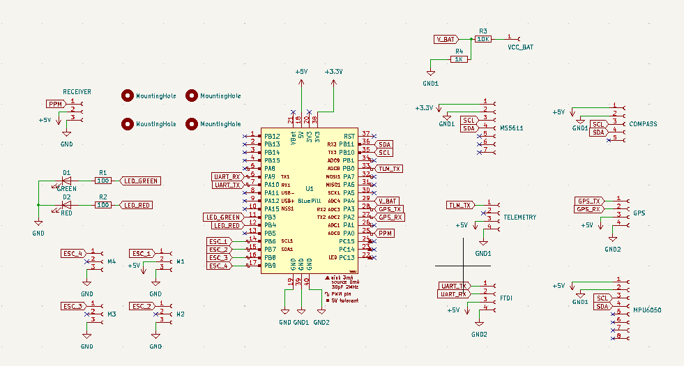
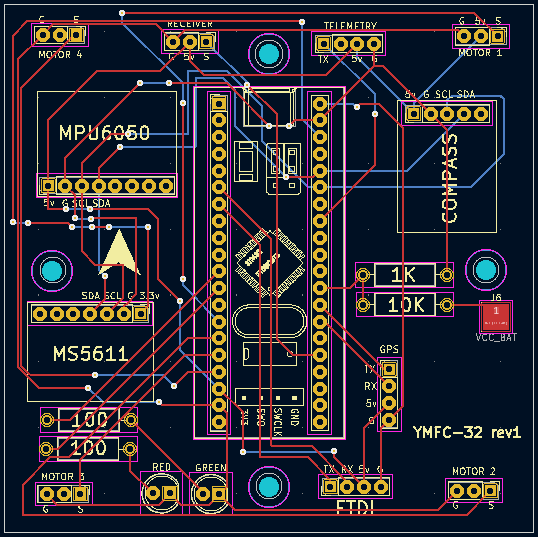
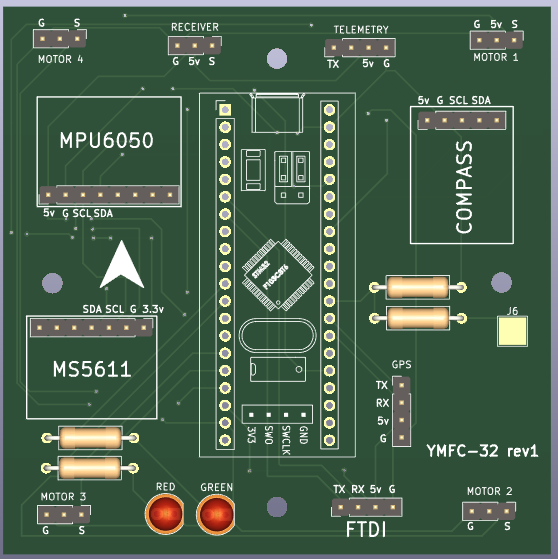

## Kicad

## What is YMFC-32

The YMFC-32 autonomous is an STM32 quadcopter flight controller that was programmed with the Arduino IDE. Its purpose is to create an educational project that can be used as a hobby or school project.

The main goals of this project are:

A bare minimum and understandable code
Try to keep the cost to a minimum

more datails here:
http://www.brokking.net/ymfc-32_auto_main.html
