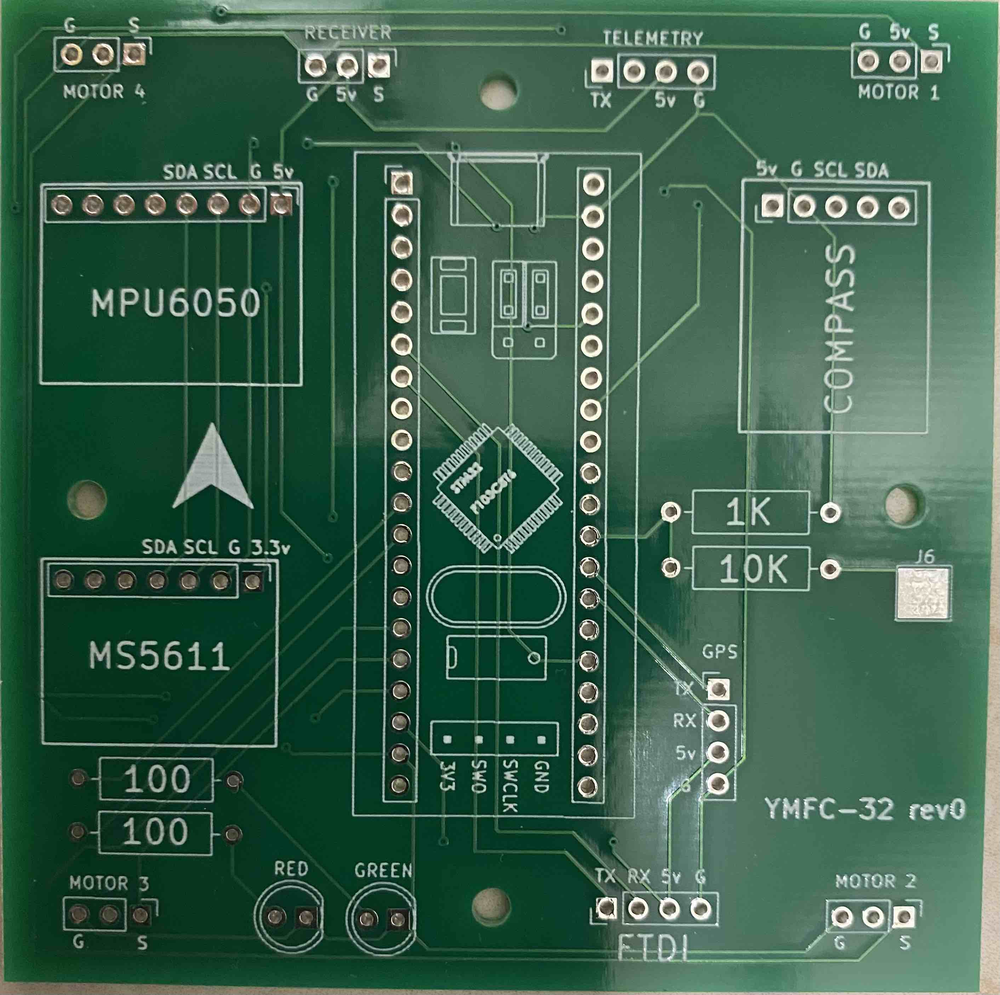
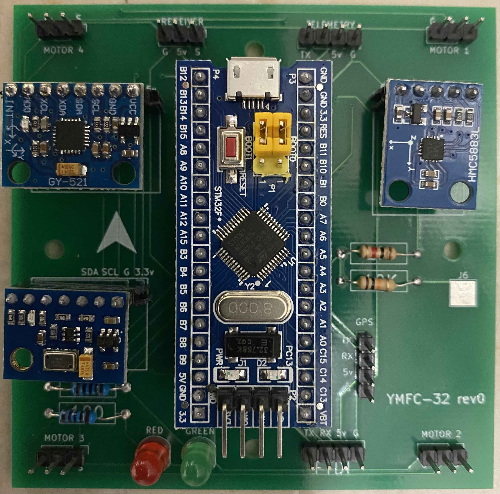

## What is YMFC-32

The YMFC-32 autonomous is an STM32 quadcopter flight controller that was programmed with the Arduino IDE. Its purpose is to create an educational project that can be used as a hobby or school project.

The main goals of this project are:

A bare minimum and understandable code
Try to keep the cost to a minimum

more datails here:
http://www.brokking.net/ymfc-32_auto_main.html

## Setup Arduino
- Search in `Boards Manager` for `Arduino SAM Boards 32bit` and install it
- Extract file `Arduino_STM32-master.zip` into `Arduino/hardware` folder.
- Select `STM32F103C series` from boards
- Variant to be `64k Flash`
- Upload method to be `Serial`
- CPU Speed to be `72Mhz`

## Testing GYRO
Quad | Should be
------|------
NOSE UP|positive PITCH
NOSE DOWN|negative PITCH
LEFT UP|positive ROLL
LEFT DOWN|negative ROLL
NOSE RIGHT|positive YAW
NOSE LEFT|negative YAW

## Kicad

PCB|3D View
-------|-------
|

## PCB Design

For PCB design i will use services from SeeedFusion. 

Seeed Fusion PCB Assembly Service offers one-stop prototyping for PCB manufacture, PCB assembly and as a result they produce superior quality PCBs and Fast Turnkey PCBA from 7 working days. When you prototype with Seeed Fusion, they can definitely provide Free DFA and Free functional tests for you! 

Check out their website to know about their manufacturing capabilities and service.
https://www.seeedstudio.com/prototype-pcb-assembly.html 

## Seeed Fusion PCBs
Empty PCB|Finished PCB
--------|--------
|

## Reasons to choose Seeed Studio
- They provide PCB services at extremely low pricing and with excellent quality.
- Their offer is structured in such a way that everyone may have these boards at a reasonable price.
- They have a highly knowledgeable crew that leads their clients to avail deals and guides them about the costs and rates of different services.
- A four-layer board with a comparable feature costs $5 for 10 pieces and is made in four days.
- SMT stencil with size (10cm x 13cm) is available for $8.00 per piece.
